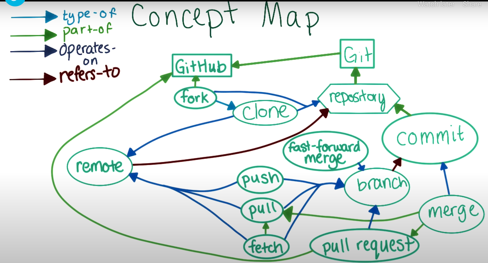

## Useful git commnands ##
See https://github.com/github/training-kit/blob/master/downloads/github-git-cheat-sheet.pdf for cheat sheet.

1. `git diff [commit ID 1] [commit ID 2]` - comparing different versions of commits across file(s)

1. `git diff` with no commit IDs will compare files between "Working Directory" and "Staging Area" (see point below on these 2 notions)

1. `git diff --staged` will compare files in "Staging Area" and the "git local repo". This is useful for checking changes before you commit to the repo.

1. `git log --stat` - gives an overview and stats included on which files are changed in each commit in a repo and the ID of commit hash for specific changes

1. `git config -global color.ui auto` - turns on the color scheme so that git diff gives you the colored differences

1. `git checkout [commit ID to revert to]` - not the same as "checkout of code" in the SVN sense. Instead this means resetting the changes to a previous commit, possibly for example to debug a previous commit / version.

1. Git doesn't allow you to save a new commit if no files have been updated.

1. Use `git init` to initialize a new git repo from a local directory, which creates the hidden meta folder ".git". No commit will done when you 1st init a new git repo.

1. Use `git status` to find out about the most current commits of a repo etc.

1. Note the mental model for assets to version control: "Working Directory" --> "Staging Area" (git managed) --> "git repo" (git managed; the one u get when u run git init on your working directory)

1. Use `git add [filename]` to add files to the "Staging Area". You can then commit the added file(s) in a logical unit later on to the local git repo.  
**Note 1:** At this stage, because the changes are not yet committed, there are no commit IDs  
**Note 2:** If you do a `git diff` (i.e. with no commit IDs), this will compare files across "Working Directory" & "Staging Area" for files NOT YET added to the "Staging Area"

1. `git commit` will batch all the files added to staging in one single commit.

1. Use `git reset [filename]` to remove files from the "Staging Area".

1. Use `git reset --hard` to discard ALL CHANGES in "Working Directory" and "Staging Area"; use this carefully!!!

1. Git uses labels to tag your commits. These labels are known as *branches*. `master` is a branch which Git creates for you when u create a new repo.

1. Use `git branch` to query all your current branches. If you have no branches created, you will only see *master* being listed. This command can also tell you which branch is the one currently checked out (seeing the * beside it).

1. Use `git branch [new branch or label name]` to create a new branch. But this will not automatically checkout the new branch; use `git checkout [new branch name]` to switch to the new branch before doing your changes. Then use `git log` to visualise all the commits for that branch.

1. Or use `git checkout -b [new branch name]` to create a new  branch and running a checkout on that branch as a 2-in-1 step.

1. Use `git log --graph --oneline [branch name 1] [branch name 2]` to visualise the commit history and compare changes between branches.

1. If a branch is deleted and leaves some commits unreachable from existing branches, those commits will continue to be accessible by commit id, until Git’s garbage collection runs. This will happen automatically from time to time, unless you actively turn it off. You can also run this process manually with `git gc`.

1. Deleting a branch is simply deleting the label for that branch.

1. Use `git merge [branch 2] [branch 3]` to merge branches into your currently checked out branch (in this case branch 1) and creating a new commit for branch 1; `git merge` will include the currently checked-out branch in the merged version.
`git merge` provides a default commit message and using it as it is recommended.

1. Restore your files to their state before you started the merge by running `git merge --abort`.

1. Comparing a commit to its parent, without knowing its parent commit id, use `git show [commit ID]`.

1. When there is a merge conflict on any of the files, inspect the fie contents and look for line(s) labelled `|||||| merged common ancestors`. Line(s) labelled `<<<<<< HEAD` are those changes made in current checked out branch; while line(s) labelled `>>>>>> master` are those changes made in master branch.

1. Remote repo (e.g. in Github) are called **remotes**. Sync (via `git push`) between local repo and remote happens at the commit IDs (history) level and that's how we will reason about changes in our code changes. Those commits which are already on remote will not be synced.

1. When you `git clone [url.git]` from a remote to your local, git will setup a link between the remote repo *origin* and your local repo. It will link the *origin* **master** branch to your local **master** branch.  
Git will also keep local copies of all remote branches from your last push and pull from the remote repo. These are locally tracked branches for the remotes are labelled with `[remote name]/[remote branch name]`, e.g. `origin/master`.

1. Use `git remote` to see all the remote repos we have. Use `git remote -v` means it will output more verbose output for the remote repo.

1. Use `git remote add [name of remote repo] [URL of the github remote repo, ending .git]` to add remote repo to github. Standard to name it *origin* if for the repo, we only have 1 remote (repo). Running `git remote` after adding will show you "origin".

1. To push changes from local repo to remote repo, use `git push [remote repo name, usually **origin**] [local branch name, usually its **master** - assuming you change and commit changes frequently and **master** branch is up to date]`  
This pushes all commits and history to the remote repo into a fresh branch and the new remote repo branch will take the same name as our local branch that we pushed (in this case **master**)  
*Further info:*  
Before we run `git push`, our change should have only existed locally via `git log`. Commits will not automatically be shared to remotes - we have to manually push our branch if we want to share changes.  
After we ran `git push`, our change should have existed locally and on our (remote) fork. It should not have existed on the original repository, which is the repository we forked. The reason we forked in the first place is because we don't have permission to change other's repository.

1. To pull changes from remote to local repo, use `git pull [remote repo name, e.g. origin] [branch name on remote repo, e.g. master]`. Once on local, do a `git log` to make sure the changes from remote are on local by looking at the commit history. And you should see the files on the local working directory folder.

1. Forking a repo to collborate with other people's repo on github. This is so because people will not usually allow changes to be made to their repo DIRECTLY through git pushes. A fork results in a remote repo (on github) being "cloned" into your own list of repos.

1. Add collaborators to your on repo on github if you want others to collaborate with changes with you. The collaborators will clone your repo onto their own local for changes.

1. Use `git remote -v` to verify you are linked to a remote repo from your local. You will see the URLs pointing to github for pull and push requests. If you have forked a repo on github and clone to your local, you will see the forked repo name under your profie name, e.g.  
origin  https://github.com/pangteckchun/first-contributions.git (fetch)
origin  https://github.com/pangteckchun/first-contributions.git (push)

1. `git fetch [remote repo name]` updates your local copy of any changes made in the remote repo branches. This will automatically fetch and update the locally tracked remote branches commit history.  
For example, `git fetch origin`.  
Then you can perform a `git diff` and `git merge` locally by comparing the changes that had happened remotely with your local master branch (or with any of your checked out branch).

1. `git pull` has the same effect of combining `git fetch` followed by a `git merge` so that your local master branch is updated with remote changes and your own changes.

1. Fast forward merge: merging 2 commits of ancestry relationship (e.g. commit *b* -- [parent of] --> commit *a*, and we merge *a* & *b* together), will result in moving the label (i.e. the branch) to *b* and not create a new merge commit.

1. PR workflow:  
a. `git pull origin master` to udpdate your local **master** branch;  
b. Create or `git checkout` to your feature branch;this will make sure you are on the feature branch and not local **master**  
c. `git merge master [branch]` to get the latest changes (synced from remote repo initially into local **master**) into your working copies in your branch;  
This is necessary because you don't to later on push changes from local master to remote master directly. All changes should only be collaborated on your branch before merging into **remote master** eventually.  
d. Resolve any conflicts from step above in your local branch and use `git log` to make the commit history contains changes from remote + your resolved conflicts;  
e. Push your branch to the remote repo branch using `git push origin [branch name]`.  
f. Submit a PR within Github (afterall PR is a Github concept; not a git feature). Remember to select the right repo as the base to which the PR is meant for to effect the change, e.g. the original repo you forked from. Many people named this original repo *upstream*, vs *origin* which is your fork.
g. Your pull request button on Github should be green;  
h. Post merging, always update your local **master** by issuing another `git pull origin master`;  
i. Run `git log -n 1` to view the latest commit log.  
GitHub automatically creates a commit message whenever a pull request is merged to make it easy to see pull requests in the commit history. Even when the merge is a fast-forward merge, GitHub still creates this commit.

1. Use `git remote add upstream [url.git of original repo from whicj you forked]` to add a link and have loca copies of the original repo branches, including **master** branch.  

## Git concept map ##
